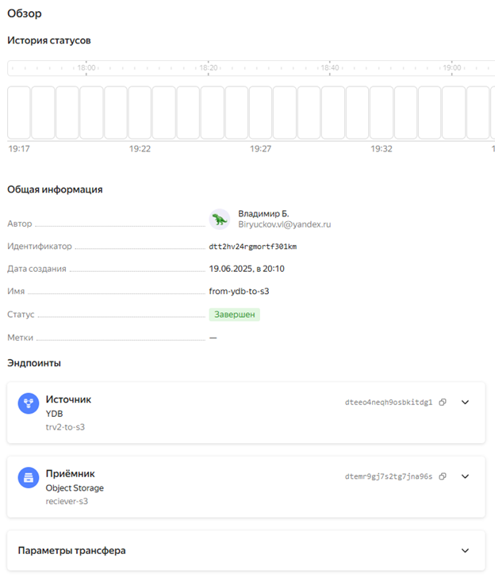

# ETL_EXAM
Этапы проекта:
1. Установка Yandex CLI, YDB CLI, настройка авторизации, создание ydb, перенос данных в s3
2. Настройка Apache Airflow, Yandex MetaDataHub, Yandex Data Processing, написание pyspark скрипта и DAG
3. Работа с топиками Apache Kafka® с помощью PySpark-заданий в Yandex Data Processing(WIP)
4. Визуализация в DataLens(WIP)
## TASK_01:
- Выполнена установка Yandex CLI + YDB CLI (version 2.19, 2.20+ is not working)
- Настроена авторизация через oauth-token + iam-token для подключения к YDB
- Создана БД ydb-spot-you(для прошлого битого датасета :disappointed_relieved::disappointed_relieved::disappointed_relieved:)
- Написан SQL-скрипт для создания таблицы:
```
create table transactions_v2 (
  msno Utf8,
  payment_method_id Int32,
  payment_plan_days Int32,
  plan_list_price Int32,
  actual_amount_paid Int32,
  is_auto_renew Int8,
  transaction_date Utf8,
  membership_expire_date Utf8,
  is_cancel Int8,
  PRIMARY KEY (msno);
```
(Стоит отметить, что выбор msno primary key нецелесообразен, так как при потенциальном использовании таблицы для присодинения к другим по этому ключу будут вызваны задержки в работе JOIN-ов)

- Использована утилита Yandex Data Transfer для переноса таблицы в s3 storage:


## TASK_02:
- Выполнена настройка Yandex MetaDataHub
- Выполнена настройка Yandex Data Processing
- Выполнена настройка Apache Airflow
- Написан скрипт обработки (приведение типов, удаление пустых стрингов)

```
from pyspark.sql import SparkSession
from pyspark.sql.functions import col, to_date
from pyspark.sql.types import IntegerType, StringType, BooleanType

#----------------------------------------
# Spark_Session + source/target
#----------------------------------------
spark = SparkSession.builder.appName("CSV_TO_SILVER_S3").getOrCreate()
source = "s3a://databucket/2025/06/19/transactions_v2.csv"
target = "s3a://databucket/transactions_v2_silver/transactions_v2_silver.csv"

try:
    df = spark.read.option("header", "true").option("inferSchema", "true").csv(source)

    df = (df.withColumn("msno", col("msno").cast(StringType())) \
        .withColumn("actual_amount_paid", col("actual_amount_paid").cast(IntegerType())) \
        .withColumn("is_auto_renew", col("is_auto_renew").cast(BooleanType())) \
        .withColumn("is_cancel", col("is_cancel").cast(BooleanType())) \
        .withColumn("membership_expire_date", to_date(col("membership_expire_date").cast("string"), "yyyy-MM-dd")) \
        .withColumn("payment_method_id", col("payment_method_id").cast(IntegerType())) \
        .withColumn("payment_plan_days", col("payment_plan_days").cast(IntegerType())) \
        .withColumn("plan_list_price", col("plan_list_price").cast(IntegerType())) \
        .withColumn("transaction_date", to_date(col("transaction_date").cast("string"), "yyyy-MM-dd")))


#--------------------
# Delete null str
#--------------------
df = df.na.drop()
df.write.mode("overwrite").csv(target)

print('SUCCESS!')
except:
    print('Try another way....')
spark.stop()
```


- Написан DAG для переноса в s3 с запуском скрипта обработки:
```
import uuid
import datetime
from airflow import DAG
from airflow.utils.trigger_rule import TriggerRule
from airflow.providers.yandex.operators.yandexcloud_dataproc import (DataprocCreateClusterOperator, DataprocCreatePysparkJobOperator, DataprocDeleteClusterOperator)

#-------------------------------
# Params
#-------------------------------
YC_DP_AZ = 'ru-central1-b'
YC_DP_SSH_PUBLIC_KEY = 'ssh-ed25519 AAAAC3NzaC1lZDI1NTE5AAAAIEomuEFRfkehHAi02uxe450FhVrs/lUjnhbRqh5r0trx vo7@DESKTOP-D5V3695'
YC_DP_SUBNET_ID = 'e2l042eonome1eobrq37'
YC_DP_SA_ID = 'ajee915p3fs4h0lpru7u'
YC_DP_METASTORE_URI = '10.129.0.18'
YC_BUCKET = 'databucket'

#-------------------------------
# DAG`s params
#-------------------------------
with DAG(
        'dag-ingest_3',
        schedule_interval='@daily',
        tags=['airflow-process'],
        start_date=datetime.datetime.now(),
        max_active_runs=1,
        catchup=False
) as ingest_dag:
    create_cluster = DataprocCreateClusterOperator(
        task_id='create-cluster',
        cluster_name=f'tmp-dp-{uuid.uuid4()}',
        cluster_description='Temporary cluster',
        ssh_public_keys=YC_DP_SSH_PUBLIC_KEY,
        service_account_id=YC_DP_SA_ID,
        subnet_id=YC_DP_SUBNET_ID,
        s3_bucket=YC_BUCKET,
        zone=YC_DP_AZ,
        cluster_image_version='2.1',
        masternode_resource_preset='s2.small',
        masternode_disk_type='network-hdd',
        masternode_disk_size=32,
        computenode_resource_preset='s2.small',
        computenode_disk_type='network-hdd',
        computenode_disk_size=32,
        computenode_count=1,
        computenode_max_hosts_count=3,
        services=['YARN', 'SPARK'],
        datanode_count=0,
        properties={
            'spark:spark.hive.metastore.uris': f'thrift://{YC_DP_METASTORE_URI}:9083',
        },
    )

#-------------------------------
# PySpark launch
#-------------------------------
spark_processing_job = DataprocCreatePysparkJobOperator(
    task_id='pyspark-t',
    main_python_file_uri=f's3a://{YC_BUCKET}/scripts/to_silver.py',
)

#-------------------------------
# Delete cluster
#-------------------------------
delete_cluster = DataprocDeleteClusterOperator(
    task_id='delete-cluster_t',
    trigger_rule=TriggerRule.ALL_DONE,
)

#-------------------------------
# DAG flow
#-------------------------------
create_cluster >> spark_processing_job >> delete_cluster
```
- Скриншот готового датасета:


